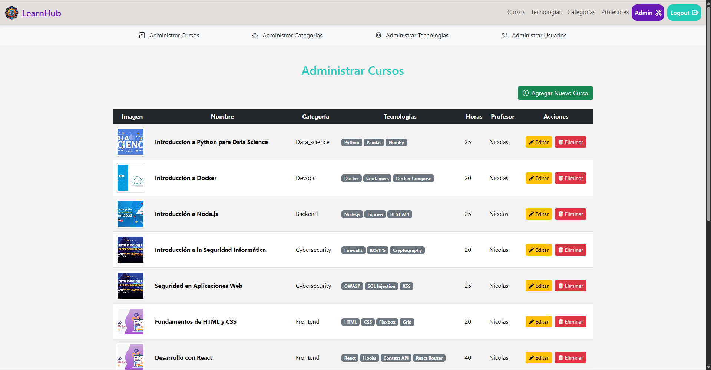

# LearnHub - Plataforma de Gestión de Cursos

LearnHub es una plataforma diseñada para conectar profesores y estudiantes, ofreciendo herramientas de administración para cursos, categorías y tecnologías. La aplicación permite una experiencia intuitiva para la creación, edición y exploración del contenido.
---

## 🖼️ Capturas

### Home / Exploración de cursos

### Panel Admin / Gestión

---

## 🚀 Tecnologías Utilizadas

### **Frontend**
- **React**: Framework para la construcción de interfaces dinámicas.
- **React Router**: Manejo de rutas y navegación protegida.
- **Bootstrap**: Estilo responsivo para interfaces modernas.
- **Context API**: Gestión de sesiones y autenticación.
- **Notificaciones**: Sistema de alertas dinámicas en tiempo real.

### **Backend**
- **Node.js**: Plataforma para la lógica del servidor.
- **Express.js**: Framework para API RESTful.
- **MongoDB**: Base de datos no relacional para almacenar datos estructurados.
- **Yup**: Validación robusta de datos.

---

## 🌟 Funcionalidades

### **General**
- Autenticación y autorización con JWT.
- Gestión de usuarios con roles específicos: alumno y profesor.

### **Cursos**
- **Crear, Editar, Eliminar y Ver**: Control completo de los cursos.
- Asignación de profesores y visualización detallada.

### **Categorías**
- **Gestión**: Crear, editar y eliminar categorías para clasificar cursos.

### **Tecnologías**
- **Manejo**: Administra tecnologías relacionadas con los cursos.

### **Administración**
- Panel exclusivo para usuarios administradores (profesores).
- Barra de acceso rápido para gestión de Cursos, Categorías y Tecnologías.

## **👤 Autor**
- Nicolás Firpo
- Correo: nicolas.firpo@davinci.edu.ar
- LinkedIn: https://www.linkedin.com/in/nicolasfirpo/
